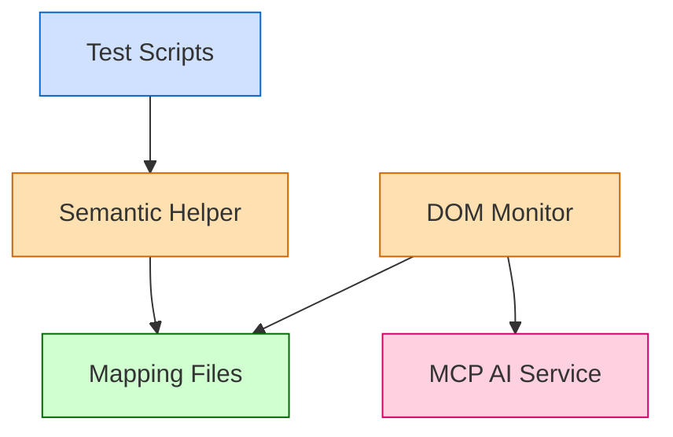

# Playwright DOM Extractor Presentation

This directory contains a [Reveal.js](https://revealjs.com/) presentation for the Playwright DOM Extractor.

## Setup

1. Install dependencies:

```bash
npm install
```

2. Start the presentation:

```bash
npm start
```

This will open the presentation in your default web browser.

## Presentation Structure

The presentation covers:

- The problem space of web element identification for testing
- How Playwright DOM Extractor solves these challenges
- Key features of the tool, including data-testid prioritization
- Integration with Cursor MCP
- Demonstration of the tool's capabilities
- Best practices for using the tool in your projects

## Running the Demo

During the presentation, you'll want to demonstrate the following:

1. Basic DOM extraction using the CLI
2. AI-powered extraction using MCP
3. Data-testid prioritization with the demo HTML file
4. Using semantic keys in a Playwright test

Follow the detailed steps in the demo script file located at `../demo-script.md`.

## Customization

Feel free to customize the presentation:

- Update the CSS in `custom.css`
- Add or remove slides in `index.html`
- Add your own branding and contact information
- Include screenshots of your specific implementation

## Additional Resources

- [GitHub Repository](https://github.com/Kamenorite/playwright-dom-extractor)
- [Documentation](https://github.com/Kamenorite/playwright-dom-extractor/blob/master/README.md)
- [Best Practices Guide](https://github.com/Kamenorite/playwright-dom-extractor/blob/master/BEST-PRACTICES.md)
- [Semantic Keys Guide](https://github.com/Kamenorite/playwright-dom-extractor/blob/master/SEMANTIC-KEYS.md)

# Presentation Visuals

## Architecture Diagram Generation

To generate the architecture diagram for the presentation, there are a few options:

1. **Using an online diagram tool**:
   - Copy the text representation from `architecture.txt`
   - Use a tool like [Mermaid Live Editor](https://mermaid.live/), [Draw.io](https://app.diagrams.net/), or [Excalidraw](https://excalidraw.com/)
   - Create the diagram based on the text representation
   - Export as PNG or SVG
   - Save as `architecture-diagram.png` in this directory

2. **Using a drawing tool**:
   - Use tools like PowerPoint, Keynote, or Figma
   - Create boxes and arrows according to `architecture.txt`
   - Use a consistent color scheme (e.g., blue for components, green for data)
   - Export as PNG at 1200x900 resolution
   - Save as `architecture-diagram.png` in this directory

3. **Using a CLI tool**:
   - If you have tools like `mermaid-cli` or `asciiflow` installed
   - Generate the diagram programmatically
   - Convert to PNG
   - Save as `architecture-diagram.png` in this directory

## Suggested Visualization

The diagram should show:

1. **Test Scripts** at the top, flowing down to **Semantic Helper**
2. **Semantic Helper** connecting to **Mapping Files**
3. **DOM Monitor** connected to **Mapping Files** (writing to them)
4. **DOM Monitor** connected to **MCP AI Service** (using it)

Use arrows to indicate data flow and dependencies between components. 

Consider using different colors to represent:
- User-facing components (Test Scripts)
- Core logic components (Semantic Helper, DOM Monitor)
- Data storage (Mapping Files)
- AI Services (MCP AI Service)

## Example Mermaid Code



Once you have created the diagram, place it in this directory as `architecture-diagram.png` for the presentation to reference it. 